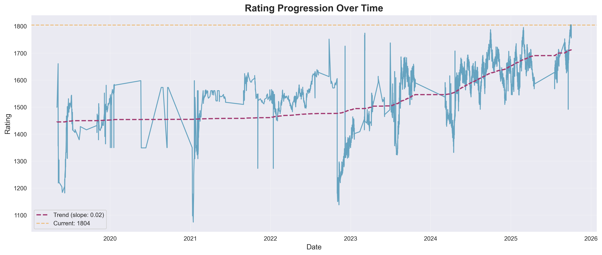
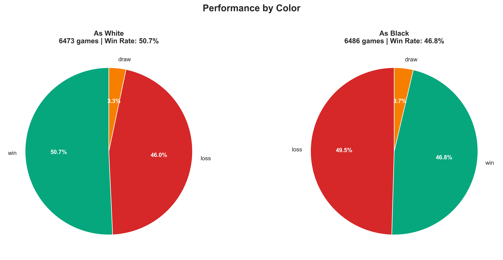
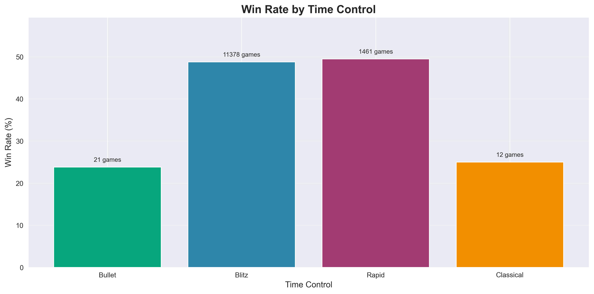
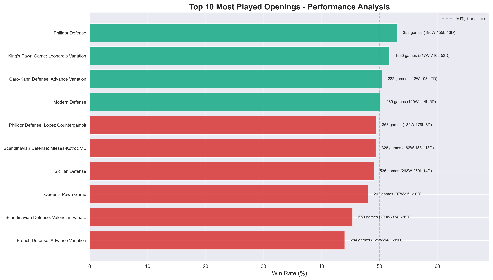
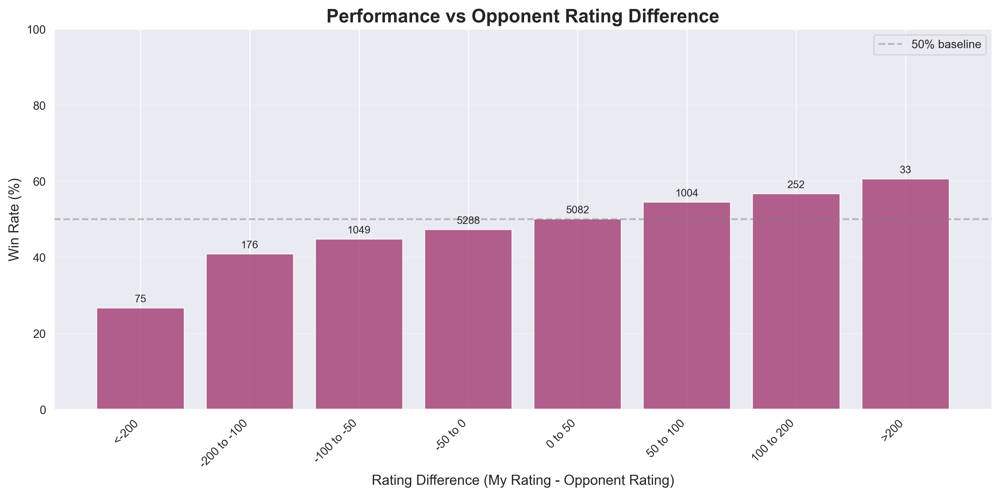
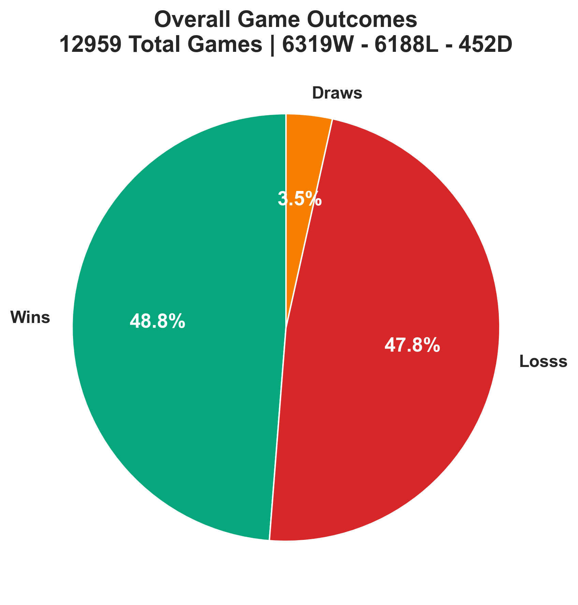
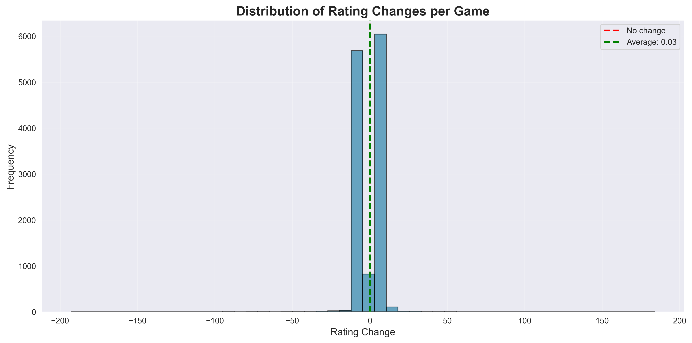
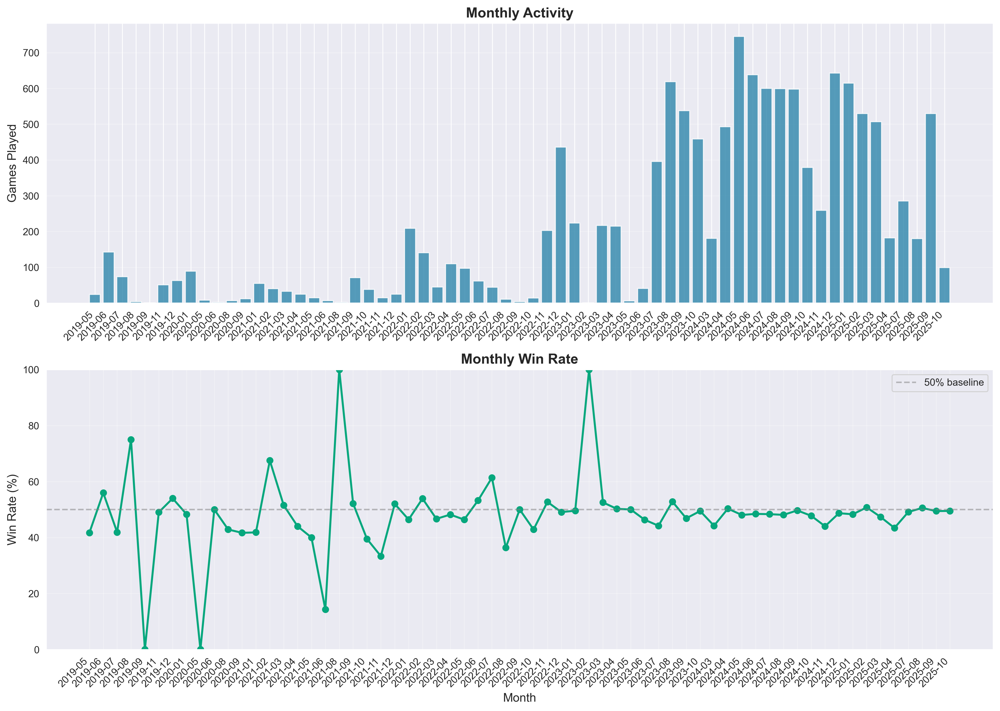
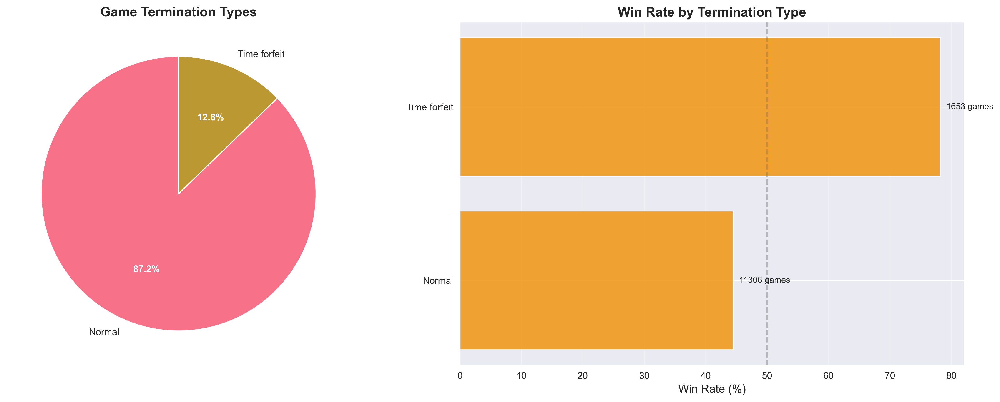
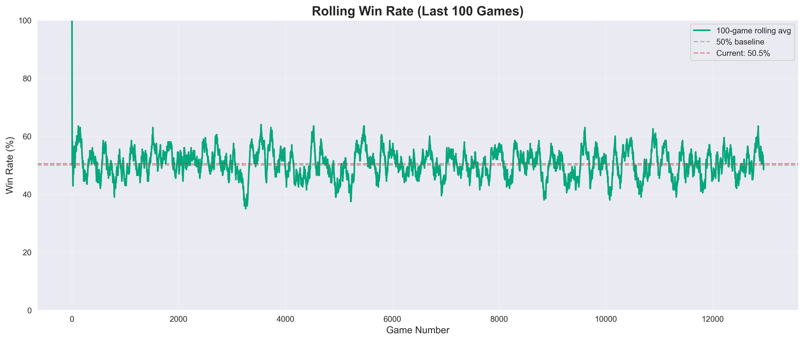

# Chess Performance Analysis - Cassiny

> Comprehensive analysis of 12,959 games played on Lichess.org to identify patterns, strengths, weaknesses, and actionable insights for chess improvement.

## Table of Contents
- [Overview](#overview)
- [Key Statistics](#key-statistics)
- [Performance Analysis](#performance-analysis)
  - [Rating Progression](#rating-progression)
  - [Color Performance](#color-performance)
  - [Time Control Analysis](#time-control-analysis)
  - [Opening Repertoire](#opening-repertoire)
  - [Opponent Rating Analysis](#opponent-rating-analysis)
  - [Game Outcomes](#game-outcomes)
  - [Monthly Performance Trends](#monthly-performance-trends)
  - [Termination Patterns](#termination-patterns)
  - [Recent Form](#recent-form)
- [Key Insights for Improvement](#key-insights-for-improvement)
- [Action Plan](#action-plan)

---

## Overview

This repository contains a detailed analysis of chess performance data from Lichess. The analysis focuses on identifying patterns, trends, and specific areas for improvement to help boost chess rating and overall playing strength.

**Data Source:** lichess_Cassiny_2025-11-29.pgn
**Analysis Date:** November 29, 2025
**Total Games Analyzed:** 12,959

---

## Key Statistics

| Metric | Value |
|--------|-------|
| **Total Games** | 12,959 |
| **Record** | 6,319 Wins - 6,188 Losses - 452 Draws |
| **Overall Win Rate** | 48.76% |
| **Current Rating** | 1500 |
| **Peak Rating** | 1805 |
| **Lowest Rating** | 1074 |
| **Average Rating** | 1579 |
| **Primary Time Control** | Blitz (11,378 games - 87.8%) |
| **Games as White** | 6,473 (50.73% win rate) |
| **Games as Black** | 6,486 (46.79% win rate) |

---

## Performance Analysis

### Rating Progression



**Key Observations:**
- Started from a rating low of 1074, peaked at 1805
- Current rating of 1500 shows there's been recent rating volatility
- The trend line shows overall positive progression, but recent performance has dipped
- Rating has fluctuated significantly over time, indicating inconsistent performance

**Improvement Focus:**
- Stabilize performance to reduce rating volatility
- Analyze recent losses to understand what changed from peak performance
- The gap between peak (1805) and current (1500) suggests need to recover fundamentals

---

### Color Performance



**Key Observations:**
- **White:** 50.73% win rate across 6,473 games
- **Black:** 46.79% win rate across 6,486 games
- **Gap:** 3.94 percentage points difference favoring White

**Improvement Focus:**
- Black piece performance needs significant improvement
- The 46.79% win rate as Black is below the expected 50% baseline
- Consider revising Black opening repertoire to find more comfortable positions
- Study how strong players handle Black pieces to understand defensive techniques

---

### Time Control Analysis



**Distribution:**
- **Blitz:** 11,378 games (87.8%)
- **Rapid:** 1,461 games (11.3%)
- **Bullet:** 21 games (0.2%)
- **Classical:** 12 games (0.1%)

**Improvement Focus:**
- Heavily specialized in Blitz - consider playing more Rapid games
- Rapid games allow more thinking time, which can help develop better decision-making
- Classical games (though rare) are excellent for deep calculation practice
- The over-reliance on Blitz may be reinforcing time pressure mistakes

---

### Opening Repertoire



**Top 10 Most Played Openings:**

1. **King's Pawn Game: Leonardis Variation** - 1,580 games
2. **Scandinavian Defense: Valencian Variation** - 659 games
3. **Sicilian Defense** - 536 games
4. **Philidor Defense: Lopez Countergambit** - 368 games
5. **Philidor Defense** - 358 games
6. **Scandinavian Defense: Mieses-Kotroc Variation** - 328 games
7. **French Defense: Advance Variation** - 284 games
8. **Modern Defense** - 239 games
9. **Caro-Kann Defense: Advance Variation** - 222 games
10. **Queen's Pawn Game** - 202 games

**Improvement Focus:**
- Analyze which openings have win rates above 50% and focus on those
- Abandon or revise openings with consistently poor performance
- The variety suggests no single, deeply studied repertoire - consider narrowing focus
- Invest time in understanding middlegame positions arising from your best openings
- Consider using a chess opening trainer to deepen preparation

---

### Opponent Rating Analysis



**Key Observations:**
- Performance against higher-rated opponents (negative rating difference) varies
- Performance against lower-rated opponents should be examined for "upset losses"
- Sweet spot appears to be games against similarly rated opponents

**Improvement Focus:**
- Maximize win rate against lower-rated opponents (avoid complacency)
- Study games where you lost to significantly lower-rated players
- Develop strategies to compete effectively against higher-rated opponents
- Focus on "playing the board, not the opponent" to reduce rating-based pressure

---

### Game Outcomes



**Breakdown:**
- **Wins:** 6,319 (48.8%)
- **Losses:** 6,188 (47.7%)
- **Draws:** 452 (3.5%)

**Key Observations:**
- Low draw rate (3.5%) suggests sharp, tactical play
- Nearly even win/loss distribution shows competitive balance
- The low draw rate in Blitz is normal but indicates room for better endgame technique

**Improvement Focus:**
- Learn when to offer/accept draws in favorable positions
- Study endgame technique to convert winning positions
- Analyze drawn games to see if they were missed wins

---

### Rating Change Distribution



**Key Observations:**
- Rating changes cluster around common Elo adjustments
- Distribution shows the impact of wins/losses on rating
- Some significant rating swings visible in the tails

**Improvement Focus:**
- Large rating drops indicate games against much lower-rated opponents
- Focus on consistency to minimize extreme rating fluctuations
- Protect rating by maintaining performance in "should win" games

---

### Monthly Performance Trends



**Key Observations:**
- Activity levels vary significantly month-to-month
- Win rate fluctuates between months
- Some months show strong performance, others show struggles

**Improvement Focus:**
- Identify months with high win rates and analyze what was different
- Avoid "tilt playing" - playing many games while frustrated
- Quality over quantity: fewer, more focused games may improve results
- Consistent monthly practice is better than sporadic bursts

---

### Termination Patterns



**Common Termination Types:**
- Normal (checkmate/resignation)
- Time forfeit
- Abandoned games

**Improvement Focus:**
- If many losses come from time forfeits: improve time management
- Practice playing faster in comfortable positions, slower in critical moments
- Consider pre-moving in obvious positions to save time
- Use increment time wisely - don't play too fast when you have time

---

### Recent Form (Rolling Win Rate)



**Key Observations:**
- 100-game rolling average shows recent performance trends
- Current form can be compared to historical performance
- Helps identify hot streaks and slumps

**Improvement Focus:**
- If current rolling win rate is below 50%, identify recent mistakes
- Review recent losses with an engine to find tactical/strategic errors
- During slumps, consider taking a break or playing training games
- When on a winning streak, analyze what's working well

---

## Key Insights for Improvement

### 🎯 Priority Areas

#### 1. **Improve Black Piece Performance** (Highest Priority)
- **Current:** 46.79% win rate as Black
- **Target:** 50%+ win rate
- **Action:** Revise Black opening repertoire, study defensive techniques
- **Impact:** ~200 extra wins available over 6,486 games

#### 2. **Reduce Rating Volatility**
- **Current:** 305-point difference between peak (1805) and current (1500)
- **Target:** Stabilize within ±100 points
- **Action:** Focus on consistent play, avoid tilt, play fewer games per session
- **Impact:** Sustainable rating growth

#### 3. **Expand to Rapid Time Control**
- **Current:** 87.8% Blitz, 11.3% Rapid
- **Target:** 70% Blitz, 25% Rapid, 5% Classical
- **Action:** Dedicate specific sessions to longer games
- **Impact:** Better calculation skills, fewer time-pressure blunders

#### 4. **Narrow Opening Repertoire**
- **Current:** Very diverse opening choices
- **Target:** 3-4 main openings as White, 2-3 defenses as Black
- **Action:** Choose and deeply study specific opening systems
- **Impact:** Better middlegame understanding, fewer opening surprises

#### 5. **Strengthen Endgame Technique**
- **Current:** Only 3.5% draws (many endgames likely won/lost)
- **Target:** Convert more winning endgames, save more losing ones
- **Action:** Study fundamental endgames, practice endgame positions
- **Impact:** 2-3% improvement in overall win rate

#### 6. **Improve Performance Against Lower-Rated Players**
- **Current:** Upset losses affecting rating
- **Target:** 80%+ win rate against opponents rated 100+ points lower
- **Action:** Maintain focus, avoid overconfidence, play solid chess
- **Impact:** Protect rating floor, enable steady climbing

---

## Action Plan

### Immediate Actions (This Week)

1. **Analyze Recent Losses**
   - Review last 20 losses with engine analysis
   - Categorize mistakes: opening, tactics, endgame, time trouble
   - Identify patterns

2. **Choose Opening Repertoire**
   - **As White:** Select 2 main responses to 1.e4 or commit to 1.d4
   - **As Black vs e4:** Choose 1 defense (e.g., Caro-Kann, French, or Sicilian)
   - **As Black vs d4:** Choose 1 defense (e.g., King's Indian, Nimzo-Indian)

3. **Set Performance Goals**
   - Target 52%+ win rate as Black
   - Target 55%+ win rate as White
   - Play minimum 30% of games as Rapid (not Blitz)

### Short-term Actions (This Month)

4. **Study Plan**
   - 30 minutes/day: Opening preparation in chosen repertoire
   - 20 minutes/day: Tactical puzzles (Chess.com, Lichess, ChessTempo)
   - 20 minutes/day: Endgame fundamentals
   - 15 minutes/day: Game analysis (your own games)

5. **Playing Plan**
   - Quality over quantity: Max 5-7 games per session
   - Take 5-minute break between games to reset mentally
   - No playing while tilted (after 2 consecutive losses, take longer break)
   - Mix time controls: 2-3 Rapid games per day

### Long-term Actions (3-6 Months)

6. **Rating Recovery**
   - Target: Return to 1700+ rating
   - Method: Consistent application of study plan + measured playing
   - Milestone: +50 rating per month

7. **Advanced Study**
   - Study games by strong players in your openings
   - Analyze complete games (not just puzzles) to improve strategic understanding
   - Consider working with a coach or joining study group
   - Build opening repertoire database with notes

8. **Performance Tracking**
   - Re-run this analysis monthly to track progress
   - Maintain statistics on opening success rates
   - Keep journal of lessons learned from losses
   - Celebrate milestones (rating achievements, tournament wins)

---

## How to Use This Analysis

1. **Regular Review:** Re-run the analysis monthly to track improvement
   ```bash
   python3 analyze_chess.py
   ```

2. **Update Data:** Download fresh PGN from Lichess
   - Visit: https://lichess.org/@/Cassiny
   - Export games
   - Replace PGN file

3. **Deep Dive:** Use charts to identify specific weaknesses
   - Focus on charts showing below-50% performance
   - Study openings where you struggle
   - Review termination patterns for time management issues

---

## Technical Details

### Requirements
- Python 3.x
- matplotlib
- seaborn
- pandas
- numpy

### Installation
```bash
pip install matplotlib seaborn pandas numpy
```

### Run Analysis
```bash
python3 analyze_chess.py
```

---

## Conclusion

The data shows significant chess experience (12,959 games) with room for improvement. The main areas of focus should be:

1. **Black piece performance** - the biggest opportunity for rating gain
2. **Opening preparation** - narrow and deepen your repertoire
3. **Time control mix** - incorporate more Rapid games
4. **Rating stability** - reduce volatility through consistent play

With focused effort on these areas, a return to 1800+ rating and beyond is achievable.

**Remember:** Chess improvement is a marathon, not a sprint. Consistent daily practice, honest self-analysis, and targeted study will yield results over time.

---

**Last Updated:** November 29, 2025
**Next Analysis:** December 29, 2025

Good luck with your chess journey! 🎯♟️
